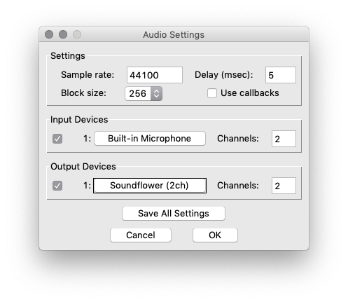

# routing a DAW into Zoom (and similar software)

to get audio from a DAW into teleconferencing or streaming software involves setting up a "loopback" virtual audio device. this device is then used as output from the DAW and input to the target software.

## Mac

install [Soundflower](https://github.com/mattingalls/Soundflower/releases).

in Audio MIDI Setup, create a multi-output device via the + button. this is for sending the DAW audio into both your actual output (so you can hear it) and Soundflower (so the target software can receive it).

set the multi-output device to use your actual sound output as well as Soundflower (2ch).

in your DAW, set the new multi-output device as your output device. make sure your input device does NOT involve Soundflower or you will have a feedback loop!

in Zoom (or whatever your target software is), set your audio input device to Soundflower (2ch).

you should now get audio from your DAW into the target software!

in order to use a microphone, you can either set it up in your DAW the usual way and enable input monitoring, or use an external application such as Pure Data to route it into Soundflower.

### microphone input with Pure Data

install [Pure Data](https://puredata.info/) (Pd).

in Pd -> Preferences -> Audio, set the input device to your microphone and the output device to Soundflower (2ch). again, be careful to avoid creating a feedback loop.

download the [input-to-output.pd](input-to-output.pd) patch from this repository (right-click the Raw button -> save link as) and open it.

you should now get microphone audio into the target software!

the gain slider can be used to adjust volume (you may need to disable Edit Mode from the Edit menu to adjust the gain, otherwise dragging the slider will just move it around the canvas).

## Windows

i havent set this up for Windows lately, but in theory it's a similar process, using e.g. [VB-CABLE](https://www.vb-audio.com/Cable/) as the loopback device. different audio driver types (WDM, ASIO) may also complicate the process, need to test...

TODO: detailed guide
